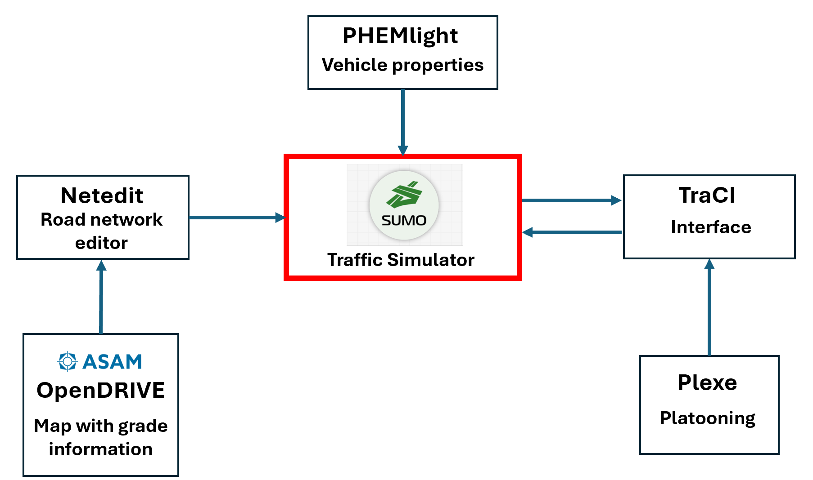

# RTSim: Road-Trip Simulator for Fuel Consumption of ICEVs with Automation

RTSim is an open-source road-trip simulator for estimating fuel consumption of Internal Combustion Engine Vehicles (ICEVs) with varying levels of automation. It extends [SUMO](https://sumo.dlr.de/) by integrating PHEMlight emission modeling, [Plexe](https://plexe.car2x.org/) for platooning, and ASAM OpenDRIVE for road grade — enabling simulation of scenarios where **drag reduction from platooning** and **speed control from automation** jointly affect fuel consumption.

Unlike existing simulators that quantify platooning benefits only through automation, RTSim also derives the benefits of **aerodynamic drag reduction** using CFD-derived drag coefficients for each vehicle position in a platoon. This distinction matters: at higher speeds, drag reduction can contribute more to fuel savings than smoother speed control alone.



## Key Features

- **Comprehensive force modeling**: PHEMlight explicitly computes rolling resistance, aerodynamic drag, gradient, and acceleration forces — not empirical lookup tables
- **Position-specific drag coefficients**: Each vehicle in a platoon gets a unique Cd value from CFD analysis, varying by position, gap, and vehicle shape
- **Multiple automation levels**: SAE Levels 0–5 implemented via driver imperfection (σ) and reaction time (τ) parameters
- **Two vehicle behaviors**: Car-following (Krauss model) and platooning (Plexe ACC/CACC)
- **Three road surface types**: Primary (highway), secondary (arterial), and cross-country (gravel) with calibrated rolling resistance
- **Road grade support**: Via OpenDRIVE elevation profiles (0–20% grade)
- **Parallel execution**: Process-level parallelism for large-scale experiments (22,000+ scenarios)

## How It Works

RTSim computes fuel consumption by summing four force components at each simulation timestep:

```
Fuel consumption ← f(P_roll + P_air + P_grad + P_accel) / η_gearbox
                      ↑          ↑         ↑           ↑
                 road type    Cd × A    grade      speed control
                 (Fr0)      (per position)         (σ, τ)
```

For **car-following**, vehicles maintain a safety gap using the Krauss model. Automation reduces speed fluctuations (lower σ) and allows shorter headways (lower τ), saving fuel through smoother driving.

For **platooning**, vehicles travel as a coordinated unit using Plexe's ACC/CACC controllers. Each vehicle gets a **position-specific drag coefficient** from CFD analysis. The combined effect of drag reduction and automation control yields fuel savings that increase with speed — the opposite of car-following, where savings decrease at higher speeds.

## Vehicle Models

RTSim was validated using five U.S. Army vehicle models. Users can substitute their own vehicles by providing PHEMlight emission files with appropriate parameters.

| Model ID | Vehicle | Mass (kg) | Frontal Area (m²) | Cd Range | Power (kW) |
|----------|---------|-----------|-------------------|----------|------------|
| Model1 | M1078 (LMTV) | 9,507 | 5.1 / 6.6 / 9.4 | 0.70–0.95 | 168 / 205 / 246 |
| Model2 | M1083 (MTV) | 9,423 | 5.1 / 6.6 / 9.4 | 0.70–0.95 | 216 / 246 / 276 |
| Model3 | M1070 (HET) | 39,009 | 6.7 | 0.80–1.00 | 373 / 523 |
| Model4 | M998 (HMMWV) | 3,574 | 4.0 | 0.68–0.80 | 112 |
| Model5 | M977 (HEMTT) | 26,816 | 4.5 | 0.75–0.95 | 332 / 373 |

Multiple values for power and frontal area correspond to different loading configurations.

> **Note:** This repository includes example data (vehicle specifications, PHEMlight base files, and CFD-derived drag coefficients) for **Model1 (M1078)** and **Model2 (M1083)** to demonstrate the simulator workflow. The remaining models used in the paper are not included due to data restrictions. Users can follow the same structure to add their own vehicle models — see [Using Your Own Vehicles](#using-your-own-vehicles).

## Automation Levels

Automation is modeled through two Krauss model parameters that control driving behavior:

| SAE Level | σ (imperfection) | τ (reaction time, s) | Description |
|-----------|-----------------|---------------------|-------------|
| 0 | 0.5 | 1.00 | No automation (human driver) |
| 1 | 0.4 | 0.95 | Driver assistance |
| 2 | 0.3 | 0.90 | Partial automation |
| 3 | 0.2 | 0.80 | Conditional automation |
| 4 | 0.0 | 0.70 | High automation |
| 5 | 0.0 | 0.60 | Full automation |

Lower σ means less speed fluctuation around the desired speed. Lower τ allows shorter following distances. Both reduce unnecessary acceleration/deceleration cycles and the associated fuel waste.

## Road Surface Types

Rolling resistance is modeled by adjusting the Fr0 coefficient in the PHEMlight emission model:

| Road Type | Fr0 | Description |
|-----------|-----|-------------|
| Primary | 0.006923 | Highways, smooth asphalt (PHEMlight default) |
| Secondary | 0.010 | Arterial roads, standard pavement |
| Cross-country | 0.025 | Gravel, unpaved surfaces |

## Drag Coefficients from CFD

Each vehicle in a platoon experiences different aerodynamic drag depending on its position and the inter-vehicle gap. We determined these values using CFD simulations in OpenFOAM with the k-ω SST turbulence model.

Drag coefficient values for Model1 and Model2 are provided in [`data/drag_coefficients.csv`](data/drag_coefficients.csv) as working examples. Users should generate their own Cd values via CFD or wind tunnel experiments for other vehicle types.

**Example** — Model1 (M1078) in a 3-vehicle platoon at 5m gap:

| Position | Role | Lower Cd | Upper Cd | Reduction from solo |
|----------|------|----------|----------|-------------------|
| 1 | Lead | 0.643 | 0.873 | ~8% |
| 2 | Middle | 0.443 | 0.601 | ~37% |
| 3 | Trailing | 0.471 | 0.639 | ~33% |

The drag reduction is **not monotonic** with gap distance — at certain spacings (~15m for some models), wake recovery dynamics can actually increase drag on the lead vehicle above the solo baseline. See Section 4 of the paper for details.

For a detailed explanation of the PHEMlight file structure and how Cd values map to simulation files, see the [PHEMlight Guide](docs/phemlight_guide.md).

## Simulation Parameters

All simulations were conducted over a standardized 1-mile road segment. Input parameters:

| Parameter | Values |
|-----------|--------|
| Slope | 0.00, 0.06, 0.08, 0.16, 0.20 |
| Road type | Primary, Secondary, Cross-country |
| Speed (km/h) | 30, 60, 90, 100 |
| Minimum gap (m) | 5, 10, 15, 20 |
| Automation level | 0, 1, 2, 3, 4, 5 |
| Acceleration (m/s²) | 0.2, 0.6, 1.0 |
| Vehicle models | 1, 2, 3, 4, 5 |
| Driving behavior | Car-following, Platooning |
| Platoon size | 1, 2, 3 |
| Trials per scenario | 20 |

## Installation

### Prerequisites

- Python >= 3.8
- [SUMO](https://sumo.dlr.de/docs/Installing/index.html) >= 1.12.0
- [Plexe](https://github.com/michele-segata/plexe-pyapi) (for platooning simulations)

### Setup

```bash
# Clone the repository
git clone https://github.com/AadyaBhattarai/RTSim.git
cd RTSim

# Create conda environment with SUMO
conda create -n rtsim python=3.10 -y
conda activate rtsim
conda install -c conda-forge sumo -y

# Set SUMO_HOME
export SUMO_HOME="$CONDA_PREFIX/share/sumo"

# Install Python dependencies
pip install -r requirements.txt

# Install Plexe (required for platooning only)
pip install git+https://github.com/michele-segata/plexe-pyapi.git
```

### Generate PHEMlight Files

Before running simulations, generate the emission files with position-specific drag coefficients:

```bash
python tools/generate_phemlight_files.py \
    --base-veh-dir data/base_phemlight/ \
    --cd-csv data/drag_coefficients.csv \
    --output-dir $SUMO_HOME/data/emissions/PHEMlight
```

## Quick Start

### Car-Following Simulation

```bash
python scripts/run_car_following_experiment.py \
    --xodr-file data/opendrive/experiment_e.xodr \
    --sumo-cfg data/sumo/configs/grade0.sumocfg \
    --route-base-dir data/sumo/routes/car_following/ \
    --phem-dir $SUMO_HOME/data/emissions \
    --trials 20 \
    --output-dir results/car_following
```

### Platooning Simulation

```bash
python scripts/run_platooning_experiment.py \
    --xodr-file data/opendrive/experiment_e.xodr \
    --sumo-cfg data/sumo/configs/grade0.sumocfg \
    --route-base-dir data/sumo/routes/platooning/ \
    --phem-dir $SUMO_HOME/data/emissions \
    --trials 20 \
    --output-dir results/platooning
```

## Project Structure

```
RTSim/
├── README.md
├── requirements.txt
├── LICENSE
│
├── data/                                # Data and configuration
│   ├── vehicle_specifications.csv       # Vehicle properties (mass, area, power, Cd)
│   ├── drag_coefficients.csv            # CFD-derived Cd values for all configurations
│   ├── automation_levels.csv            # σ and τ values for SAE levels 0–5
│   ├── rolling_resistance.csv           # Fr0 coefficients per road type
│   ├── base_phemlight/                  # Base .veh templates (one per model)
│   ├── opendrive/                       # OpenDRIVE road network files
│   │   └── experiment_e.xodr
│   └── sumo/                            # SUMO configuration files
│       ├── configs/
│       └── routes/
│           ├── car_following/           # Route templates for car-following
│           └── platooning/             # Route templates for platooning
│
├── tools/                               # Automation scripts
│   └── generate_phemlight_files.py      # Generate .veh files from base + Cd CSV
│
├── scripts/                             # Experiment runners
│   ├── run_platooning_experiment.py
│   └── run_car_following_experiment.py
│
├── docs/                                # Documentation
│   ├── framework.png                    # RTSim framework diagram
│   ├── phemlight_guide.md              # PHEMlight file structure explained
│   ├── installation.md
│   ├── parameters.md
│   └── opendrive_guide.md
│
├── examples/                            # Minimal working examples
│   ├── example_platooning.py
│   └── example_car_following.py
│
└── results/                             # Simulation outputs (git-ignored)
```

## Using Your Own Vehicles

RTSim is designed to work with any ICEV. To use your own vehicles:

1. **Obtain a PHEMlight .veh file** for your vehicle type from [TU Graz](https://www.tugraz.at/) or create one with the vehicle's mass, power, gear ratios, and base Cd.

2. **Run CFD analysis** for your vehicle geometry to determine drag coefficient reductions at different platoon positions and gaps. We used OpenFOAM with scaled bluff bodies and k-ω SST turbulence.

3. **Create a drag coefficients CSV** following the format in `data/drag_coefficients.csv`.

4. **Generate PHEMlight files** using the provided tool:
   ```bash
   python tools/generate_phemlight_files.py \
       --base-veh my_vehicle.veh \
       --cd-csv my_cd_values.csv \
       --output-dir PHEMlight \
       --model MyModel
   ```

5. **Create route file templates** with matching `emissionClass` paths pointing to your generated PHEMlight files.

## Output

Simulation results are saved in Excel format with two files:

- **Raw data** (`*_raw.xlsx`): Individual fuel consumption measurements from each trial, vehicle, and scenario
- **Confidence intervals** (`*_ci.xlsx`): Statistical summary with 95% confidence intervals grouped by scenario parameters

Key output columns:

| Column | Description |
|--------|-------------|
| Model | Vehicle model identifier |
| Vehicle | Vehicle ID (v.0.0 = lead, v.0.1 = follower, etc.) |
| Fuel_L_per_100km | Fuel consumption in liters per 100 km |
| Mean | Average across trials |
| CI_Lower / CI_Upper | 95% confidence interval bounds |

## Citation

If you use RTSim in your research, please cite:

```bibtex
@article{bhattarai2025rtsim,
  author  = {Bhattarai, Aadya and Charkhgard, Hadi and Shah, Ankit and Pohland, Timothy and Das, Tapas K.},
  title   = {Developing a Road-Trip Simulator ({RTSim}) and a Fuel Consumption
             Prediction Model for Internal Combustion Engine Vehicles ({ICEVs})
             with Automation},
  journal = {SSRN Electronic Journal},
  year    = {2025},
  doi     = {10.2139/ssrn.6353058},
  url     = {https://ssrn.com/abstract=6353058}
}
```

## Acknowledgments

This research was sponsored by the Transformation Decision Analysis Center (TDAC) under Cooperative Agreement Number W911NF-22-2-0001. We acknowledge Michele Segata (University of Trento) for guidance on the Plexe framework and TU Graz for providing PHEMlight emission files.

## License

This project is licensed under the MIT License — see [LICENSE](LICENSE) for details.

## Contact

- Aadya Bhattarai — aadyab@usf.edu
- Industrial and Management Systems Engineering, University of South Florida
